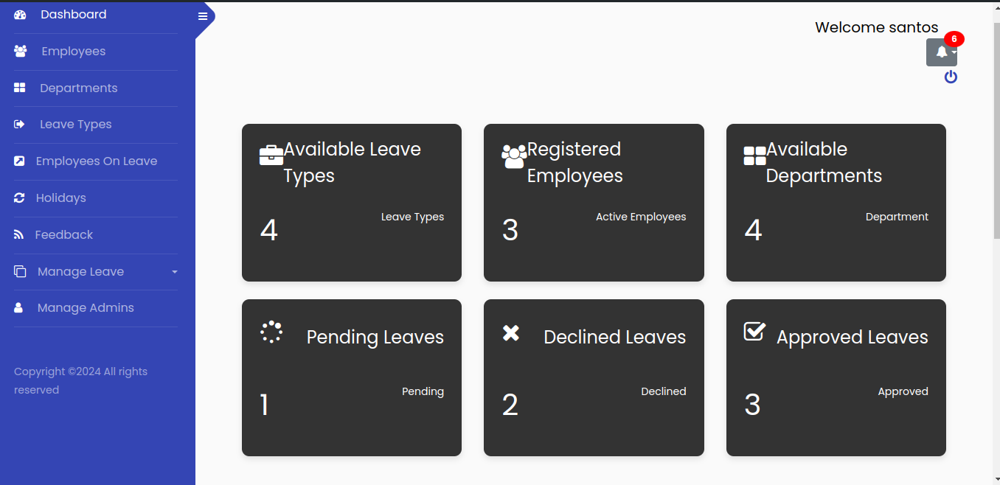

# Leave Management System

## Introduction

The **Leave Management System** is a web-based application designed to help organizations manage employee leave requests efficiently. It allows employees to apply for leave, view leave history, and update their profiles. Administrators can manage employee data, leave types, departments, and leave applications, including approving or declining leave requests.

## Table of Contents

- [Features](#features)
- [Technologies Used](#technologies-used)
- [System Architecture](#system-architecture)
- [Database Design](#database-design)
- [Installation](#installation)
- [Usage](#usage)
- [Screenshots](#screenshots)
- [Contributors](#contributors)
- [License](#license)

## Features

### Employee Features:
- **Apply for Leave**: Employees can submit leave applications.
- **View Leave History**: Employees can see their leave history.
- **Profile Management**: Employees can update their personal details.

### Admin Features:
- **Manage Employees**: Add, edit, or delete employee details.
- **Manage Departments**: Add, edit, or delete departments.
- **Manage Leave Types**: Add, edit, or delete leave types.
- **Approve/Decline Leave**: Approve or decline leave requests.
- **View Employees on Leave**: View current employees on leave grouped by departments.

### Notifications:
- Real-time notifications for employees and admins regarding leave approvals, rejections, and other updates.

### Security:
- User authentication and authorization with **Django**'s built-in security measures.

## Technologies Used

- **Frontend**: HTML, CSS (Bootstrap), JavaScript, jQuery
- **Backend**: Python (Django Framework)
- **Database**: SQLite3 (or PostgreSQL in production)
- **Version Control**: Git
- **Notification System**: Django channels or standard Django notifications
- **Others**: FontAwesome for icons, Google Fonts

## System Architecture

This system follows a 3-tier architecture:
1. **Presentation Layer (Frontend)**: User interface elements including forms, dashboards, and notifications.
2. **Business Logic Layer (Backend)**: Manages leave applications, approvals, user authentication, and data validation.
3. **Data Layer (Database)**: Stores user information, leave data, departments, and system logs.

### Class Diagram

- **Employee**: Handles employee profile data and leave requests.
  - Methods: `applyLeave()`, `viewLeaveHistory()`, `updateProfile()`
- **Admin**: Handles system management functionalities.
  - Methods: `addEmployee()`, `editEmployee()`, `deleteEmployee()`, `approveLeave()`, `declineLeave()`, etc.
- **LeaveApplication**: Manages leave applications.
  - Methods: `validateApplication()`, `saveApplication()`
- **Department**: Manages departments.
  - Methods: `addDepartment()`, `editDepartment()`, `deleteDepartment()`
- **LeaveType**: Manages leave types.
  - Methods: `addLeaveType()`, `editLeaveType()`, `deleteLeaveType()`

## Database Design

The system follows **Third Normal Form (3NF)** for database design, ensuring data consistency and normalization. Key tables include:

- `Employees`: Stores employee details.
- `Departments`: Stores department information.
- `LeaveTypes`: Stores different types of leave (e.g., vacation, sick leave).
- `LeaveApplications`: Stores leave request data.
- `Admins`: Stores admin details for system management.

### Example Database Schema:
- `Employee`: (employee_id, name, email, department_id, status)
- `LeaveApplication`: (leave_id, employee_id, leave_type_id, start_date, end_date, reason, status)
- `LeaveType`: (leave_type_id, leave_type_name)
- `Department`: (department_id, department_name)
- `Admin`: (admin_id, username, password)

## Installation

1. Clone the repository:

   ```bash
   git clone https://github.com/santospaul1/Leave_Management_System_project
   cd Leave_Management_System_project

2. Create a virtual environment and activate it:

   ```bash
    python3 -m venv venv
    source venv/bin/activate  # On Windows use `venv\Scripts\activate`
   
3. Install the required dependencies:

   ```bash
    pip install -r requirements.txt
4. Run database migrations:

    ```bash

    python manage.py migrate
    
5. Create a superuser for admin access:

   ```bash
    python manage.py createsuperuser
   
6. Start the development server:

    ```bash
   python manage.py runserver

7. Access the application at http://127.0.0.1:8000/.

## Usage
### For Employees:
- Login to the system.
- Apply for leave via the "Apply Leave" section.
- Check the status of leave applications under "Leave History".
- Edit your personal information under "Profile".
### For Admins:
- Login using the admin credentials.
- Manage employees, leave types, and departments under the Admin Panel.
- Approve or decline leave requests.
- View current employees on leave, grouped by department.
  
## Screenshots



<h2>Contributors</h2>
Santos Paul Amiani - Developer

<h2>License</h2>
This project is licensed under the MIT License - see the LICENSE file for details.
